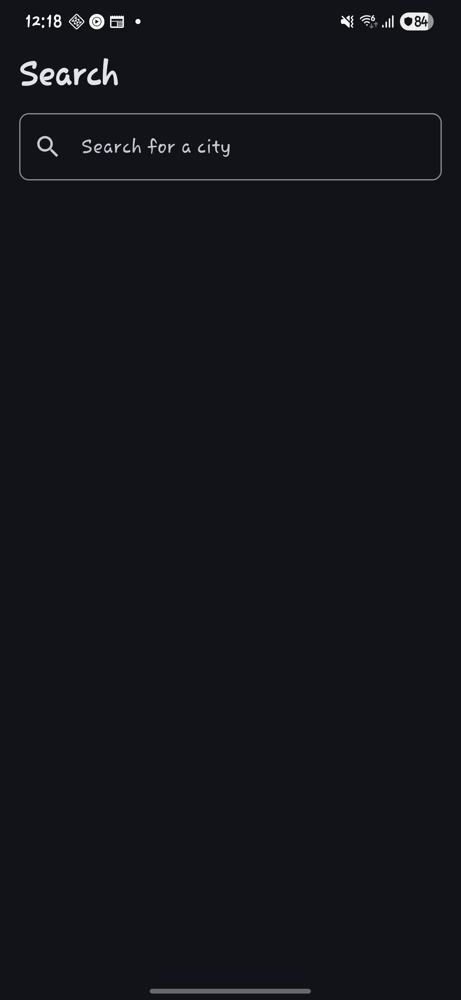
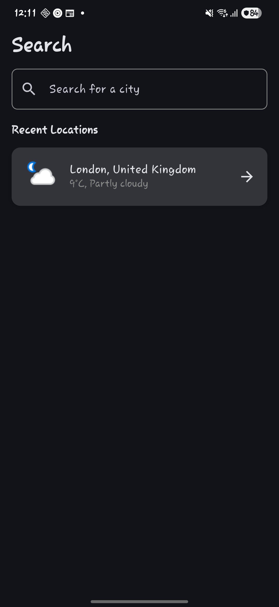
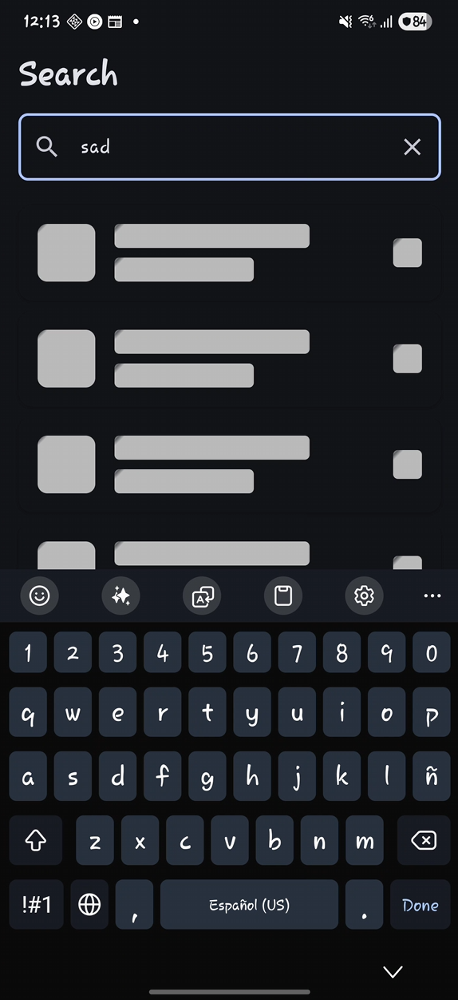
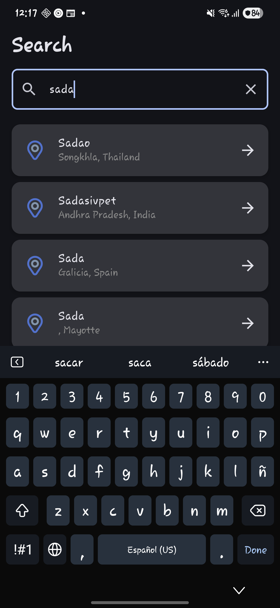
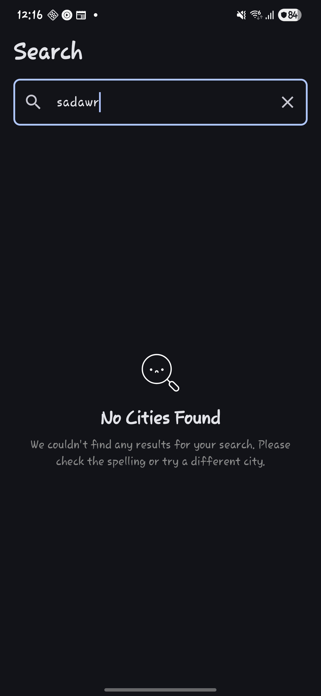
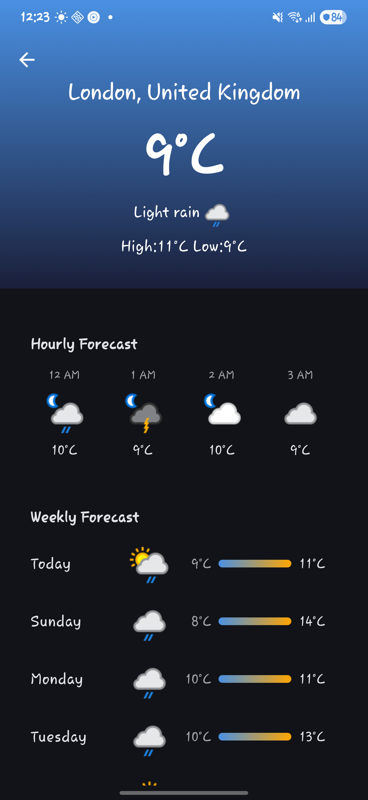

# WeatherApp

WeatherApp is a modern Android application built with Kotlin and Jetpack Compose that provides current weather information. It fetches data from a remote weather API and displays it in a clean, user-friendly interface.

## Table of Contents

* [Features](#features)
* [Architecture](#architecture)
* [Tech Stack & Dependencies](#tech-stack--dependencies)
* [File Structure](#file-structure)
* [Getting Started](#getting-started)
  * [Prerequisites](#prerequisites)
  * [Adding the API Key](#adding-the-api-key)
  * [Running the App](#running-the-app)
* [Workaround for Android Versions Below Pie (API < 28)](#workaround-for-android-versions-below-pie-api--28)

## Features

* Display current weather conditions.
* Modern, declarative UI built with Jetpack Compose.
* Caches data locally for offline access using Room.
* Asynchronous operations managed with Kotlin Coroutines.

## Screens

### Splash
This screen displays and animation and perform 2 initial validations, one for network availability and the other for the API key, to verify that is not empty or the placeholder

]
### Search
This screen allows the users to interact with the search bar and look for the city that they are interested, it has 5 main states:
#### Idle
This state is the initial state when the users has not yet interacted with the app

#### Idle with recent searches
In this status the user has already done some search that are displayed as recent searches to allow the user to choose one

#### Loading
The user is interacting with the search bar and the app is fetching the data from the API

#### Success
The user has successfully fetched the data from the API

#### No results found
No results were found for the text wrote inside the search bar 

### Detail
This screen shows the weather information for the selected city


## Architecture

This app follows the Model-View-ViewModel (MVVM) architecture pattern, which is recommended for modern Android development. This promotes a separation of concerns, making the app more robust, testable, and maintainable.

* **Model**: Represents the data layer, responsible for fetching data from the network (using Retrofit) and caching it locally (using Room). This layer is abstracted by a Repository.
* **View**: The UI layer, built with Jetpack Compose. It observes the ViewModel for state changes and renders the UI accordingly. It also forwards user interactions to the ViewModel.
* **ViewModel**: Acts as a bridge between the Model and the View. It holds and manages UI-related data in a lifecycle-conscious way. It exposes state to the UI and contains the business logic to handle user interactions, but it has no direct reference to the Android UI, which makes it easy to test.

Dependency Injection is managed by Hilt, which simplifies the process of providing dependencies to different parts of the application.

## Tech Stack & Dependencies

* **UI**: Jetpack Compose for a fully declarative UI.
* **Architecture**: MVVM, ViewModel, Lifecycle.
* **Dependency Injection**: Hilt for managing dependencies.
* **Asynchronous Programming**: Kotlin Coroutines for managing background tasks.
* **Networking**: Retrofit for making API calls and OkHttp as the HTTP client.
* **Data Serialization**: Kotlinx.serialization for parsing JSON.
* **Database Caching**: Room for local data persistence.
* **Navigation**: Compose Navigation for navigating between screens.
* **Image Loading**: Coil for loading images asynchronously.

## File Structure

The project follows a standard Android structure, with the code organized into packages based on features and layers.

```kotlin
app/
└── src/
    └── main/
        ├── java/com/jlbeltran94/weatherapp/
        │   ├── data/
        │   │   ├── local/          # Room database, DAOs, and entities
        │   │   ├── remote/         # Retrofit API interface, DTOs
        │   │   └── repository/     # Repository implementation
        │   ├── di/                 # Hilt dependency injection modules
        │   ├── domain/
        │   │   ├── model/          # Core domain models
        │   │   └── repository/     # Repository interface
        │   └── presentation/       # UI layer (Compose screens, ViewModels, etc.)
        │       ├── components/     # Reusable UI components
        │       ├── screens/        # Main composable screens
        │       └── util/           # Utility classes and extensions
        │           └── extensions/ # Extension functions (e.g., StringExtensions.kt)
        └── res/
            ├── drawable/
            ├── layout/
            └── values/
```

## Getting Started

### Prerequisites

* Android Studio (latest stable version recommended)
* Java 17 (required by the Android Gradle Plugin)
* An Android device or emulator

### Adding the API Key

The application requires an API key from a weather service provider (like WeatherAPI.com) to fetch data. You need to add this key to your project's `local.properties` file. This file is not checked into version control, ensuring your key remains private.

1.  Open the `local.properties` file located in the root directory of your project. If it doesn't exist, create it.
2.  Add the following line to the file, replacing `"YOUR_API_KEY"` with your actual key:

```properties
WEATHER_API_KEY="YOUR_API_KEY"
```

3.  The key is then accessed in the app via the `BuildConfig` file, which is configured in your `build.gradle.kts (app)` file.

### Running the App

1.  Clone the repository, example using ssh:

```kotlin
git clone git@github.com:jlbeltran94/WeatherApp.git 
```

2.  Open the project in Android Studio.
3.  Let Android Studio sync the project and download all dependencies.
4.  Select a run configuration (an emulator or a connected physical device).
5.  Click the **Run** button (▶️) to build and install the app on your selected device.

## Workaround for Android Versions Below Pie (API < 28)

Issues were encountered on Android versions below Android 7.1.1 (e.g., SDK 21 Lollipop 5.0) due to SSL handshake failures. The weather API's security certificate from Let's Encrypt is no longer trusted by these older Android versions because a legacy root certificate has expired. more info  [here](https://letsencrypt.org/2020/11/06/own-two-feet.html)

That required a specific workaround to handle how image and api URLs are constructed, ensuring compatibility with older Android versions.

**The Problem**: The weather API returns icon URLs without a protocol scheme (e.g., `//cdn.weatherapi.com/weather/64x64/day/113.png`). To be used by image loading libraries like Coil, these URLs must be prepended with either `http:` or `https:.`

Starting with Android 9.0 (Pie, API 28), cleartext (non-HTTPS) traffic is disabled by default for security reasons. This means apps targeting this version or higher will block HTTP requests unless explicitly configured otherwise.

**The Solution**: The `String.withProtocol()` extension function in `presentation/util/extensions/StringExtensions.kt` addresses this issue:

```kotlin
fun String.withProtocol(): String {
    return if (Build.VERSION.SDK_INT >= Build.VERSION_CODES.P) {
        "https:$this" // Use HTTPS for API 28+
    } else {
        "http:$this"  // Use HTTP as a fallback for older versions
    }
}
```

This function dynamically prepends the correct protocol based on the device's Android version:

* **On Android 9 (API 28) and newer**: It uses `https:`, which is secure and compliant with modern security standards.
* **On Android versions older than 9**: It falls back to `http:`. This avoids cleartext traffic errors on newer devices while maintaining image-loading functionality on older ones without requiring extra network security configuration.
